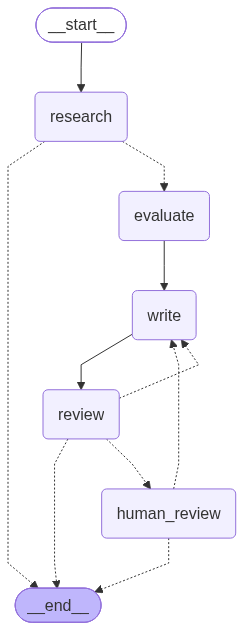

# get_hired

취업 지원 현황을 관리하고, 지원 건을 등록하면 AI 에이전트들이 기업 조사부터 적합도 평가, 지원동기 초안, 검수까지 이어서 처리하는 개인용 웹 서비스입니다. 혼자 로컬 PC에서 쓰는 도구이면서, LangGraph로 멀티 에이전트 흐름을 직접 짜 본 실습 프로젝트입니다.

## 주요 기능

- **지원 현황 대시보드**: 단계별 통계, 마감일 D-day, 필터·정렬, 응답 없는 지원 건 일괄 불합격 처리
- **공고 캡처 읽기**: 채용 공고 캡처를 붙여넣으면 AI가 읽어 주요 업무·자격 요건·우대 사항 칸을 채움
- **에이전트 분석**: 지원 건을 등록하면 기업 분석, 적합도 점수·등급, 지원동기 초안, 제목 후보를 자동 생성
- **프로필·지침 버전 관리**: 지원자 프로필과 작성 규칙을 버전으로 쌓고, 버전끼리 비교
- **실행 기록과 비용**: AI 호출마다 입력·출력·토큰을 기록하고 모델별 예상 비용을 표시
- **AI 선택**: Claude와 Gemini 중 골라 쓰고, API 키는 암호화해 저장

## 에이전트 분석 그래프



| 노드 | 역할 |
|---|---|
| `research` | 웹 검색(최대 3회)으로 기업을 조사해 기업 분석을 쓰고, 기업의 업종·규모를 채움 |
| `evaluate` | 지원자 프로필과 공고를 견주어 적합도 평가, 점수(0~100), 등급을 냄 |
| `write` | 지원동기 초안과 제목 후보를 씀 |
| `review` | 작성 규칙 위반과 프로필에 없는 경험을 지어냈는지 점검 |
| `human_review` | AI끼리 해결하지 못하면 멈춰서 사람에게 물음 |

흐름이 AI의 판단에 따라 달라지는 지점은 세 군데입니다.

- **검수 후 재작성**: 검수에서 지적이 나오면 지적 사항과 함께 작성 노드로 되돌립니다(최대 2회).
- **휴먼 인 더 루프**: 2회를 다시 써도 지적이 남으면 `interrupt()`로 그래프를 멈춥니다. 사용자가 "이대로 저장"을 고르거나 지시를 적어 주면 멈춘 자리에서 이어 갑니다. 멈춘 상태는 PostgreSQL 체크포인터에 저장되어 서버를 껐다 켜도 유지됩니다.
- **기업 조사만 하고 종료**: 지침 버전을 고르지 않은 지원 건은 평가 기준이 없으므로 기업 조사에서 끝냅니다.

중간에 실패해도 그때까지 나온 결과는 저장하고, 어느 노드에서 왜 실패했는지 관리자 화면에 남깁니다.

## 설계에서 신경 쓴 점

- **프롬프트 조립을 코드로 고정**: 시스템 지시 → 지침(고정 정보 → 작성 규칙 → 요청 사항 → 기타) → 기업 → 공고 → 앞 단계 결과 순서로 항상 같게 조립합니다. (`applications/prompts.py`)
- **결과 틀은 구조화 출력으로 강제**: 점수는 정수, 등급은 다섯 단계 중 하나처럼 형식을 스키마로 묶어 파싱 실패를 없앴습니다.
- **모든 AI 호출을 한 곳으로**: 어떤 경로로 부르든 `record_run()`을 거쳐 실행 기록(`AgentRun`)이 남습니다. (`agents/services.py`)
- **체크포인트에 넣을 것과 뺄 것 구분**: 그래프 상태에는 글자와 숫자만 담고, Django 모델 객체는 실행할 때마다 context로 넘깁니다.
- **API 키 보호**: Fernet으로 암호화해 DB에 저장하고, 화면에는 끝 4자리만 보여 줍니다.

## 기술 스택

| 구분 | 사용 기술 |
|---|---|
| 웹 | Python 3.11, Django 5.2 (템플릿 기반 SSR), TailwindCSS, SweetAlert2 |
| DB | PostgreSQL (psycopg 3) |
| 에이전트 | LangGraph, langgraph-checkpoint-postgres, LangChain(Anthropic·Google GenAI) |
| AI | Claude, Gemini (구조화 출력, 웹 검색 도구, 이미지 입력) |

## 실행 방법 (Windows / PowerShell)

준비물: Python 3.11 이상, PostgreSQL, Node.js

```powershell
# 1. 가상환경과 패키지
python -m venv .venv
.\.venv\Scripts\Activate.ps1
pip install -r requirements.txt

# 2. 환경변수: .env.example 을 .env 로 복사한 뒤 SECRET_KEY 와 DB 정보를 채움
Copy-Item .env.example .env

# 3. DB 와 계정
python manage.py migrate
python manage.py createsuperuser

# 4. CSS 빌드 도구 설치 (처음 한 번)
python manage.py tailwind install

# 5. 실행 (터미널 2개)
python manage.py tailwind start
python manage.py runserver
```

로그인한 뒤 **사용자** 메뉴에서 쓸 AI를 고르고 API 키를 입력하면 에이전트 기능이 켜집니다.

```powershell
# 테스트 (AI 호출은 가짜 답으로 바꿔 실행하므로 API 키와 비용이 들지 않음)
python manage.py test

# 분석 그래프 그림 다시 만들기
python manage.py draw_analysis_graph
```

## 디렉터리 구조

```
config/         설정, URL
applications/   지원 건, 기업, 대시보드, 분석 그래프
  analysis_graph.py   LangGraph 그래프 정의 (노드, 분기, 체크포인터)
  prompts.py          노드별 프롬프트와 조립 순서
  services.py         분석 실행·재개·저장, 공고 캡처 읽기
profiles/       프로필·지침 버전 관리
agents/         AI 설정, 실행 기록, 모델 호출
  llm.py              그래프 노드용 LangChain 모델 호출
  providers.py        단발 호출용 Claude·Gemini SDK 호출
  services.py         실행 기록을 남기는 공통 진입점
  pricing.py          모델별 토큰 단가와 예상 비용
templates/      화면
theme/          TailwindCSS (django-tailwind)
```

## 앞으로 할 것

- 평가 후 작성 전에 강조할 내용을 묻는 두 번째 사람 확인 지점
- 이력서·포트폴리오 PDF로 프로필 초안 만들기
