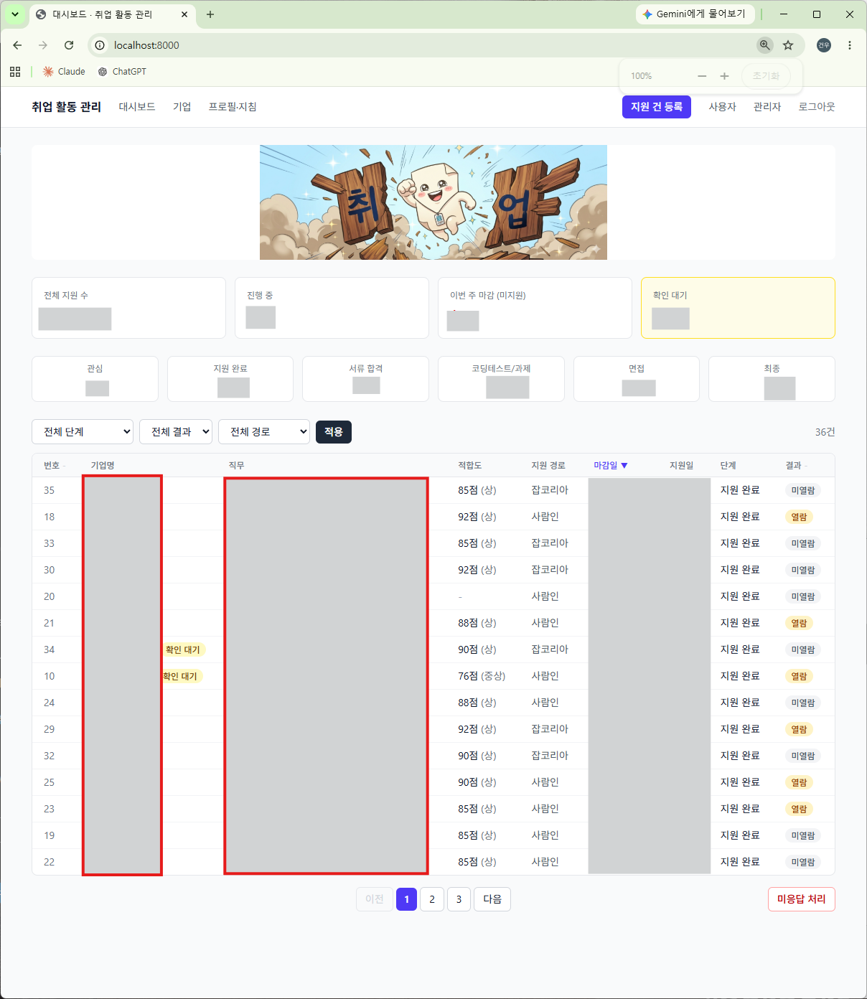
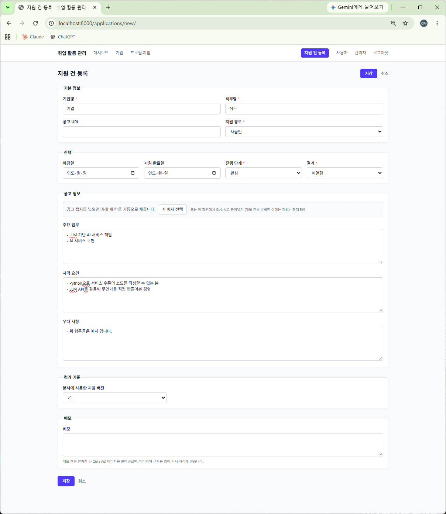
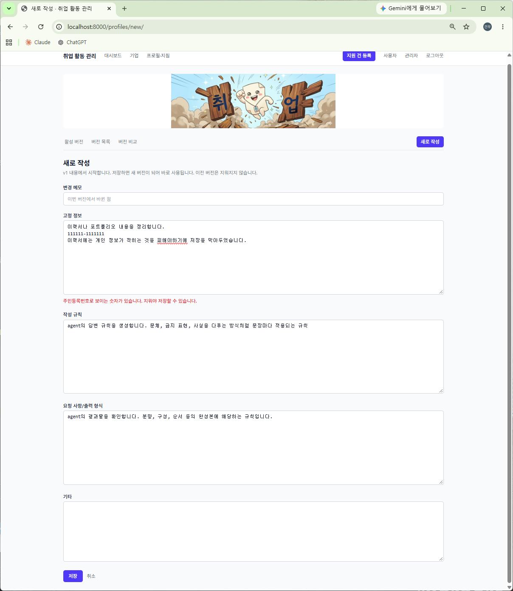
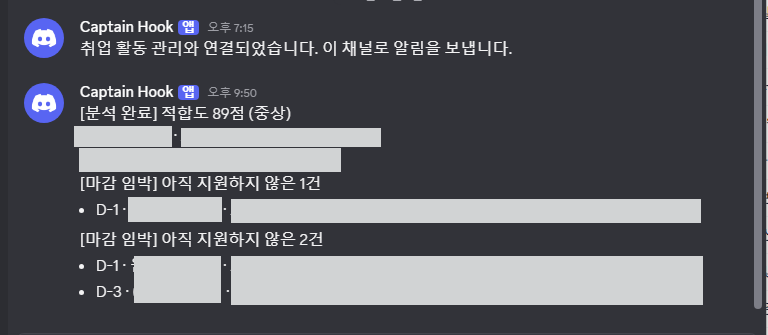
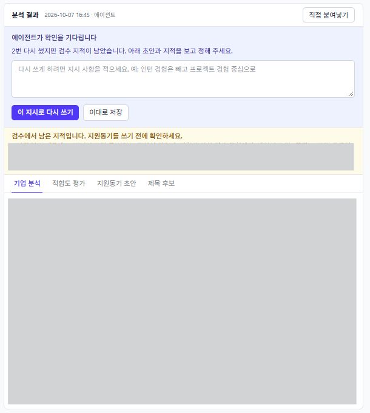
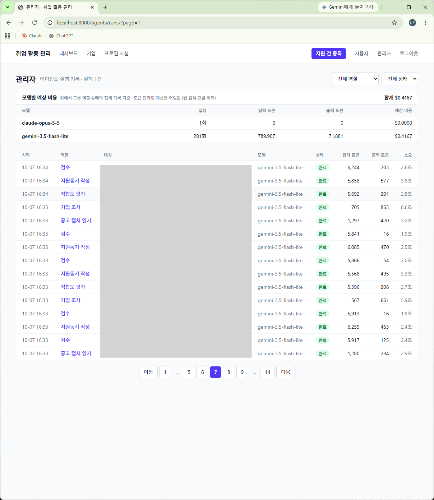
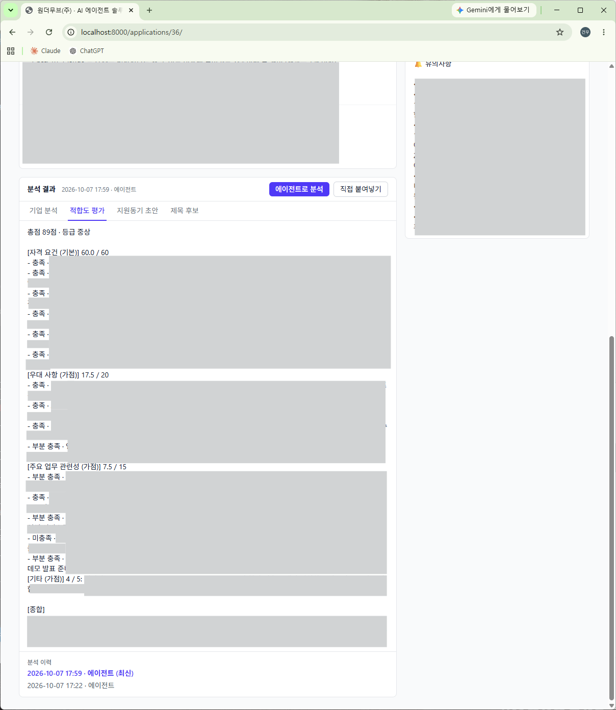

# get_hired

취업 지원 현황을 관리하고, 지원 건을 등록하면 AI 에이전트들이 기업 조사부터 적합도 평가, 지원 서류 초안 작성, 검수까지 이어서 처리하는 개인용 웹 서비스입니다. 혼자 로컬 PC에서 쓰는 도구이면서, LangGraph로 에이전트 팀의 역할·워크플로우·승인 기준을 직접 설계해 본 프로젝트입니다.

목표는 이력서와 자기소개서 작성을 돕는 도우미입니다. AI가 쓴 글을 그대로 내는 것이 아니라, 사람이 고쳐 쓸 출발점이 되는 초안을 빠르게 받는 데 초점을 두었습니다. 지금은 자기소개서 항목 중 **지원동기** 하나를 지원하고, 같은 틀로 다른 항목과 이력서까지 넓혀 갈 수 있게 만들었습니다.

## 무엇을 자동화했나

### 원래 하던 일

공고 하나에 지원할 때마다 다음 일을 반복했습니다.

1. 지원할 공고를 확인한다.
2. 이력서와 자기소개서 초안을 쓴다.
3. AI(GPT, Gemini, Claude 등)에 초안을 넣어 첨삭을 받는다.
4. 첨삭된 내용에 잘못된 곳이 없는지 직접 검증해 가며 완성본을 쓴다.

공고가 수십 개로 늘어도 이 과정은 공고마다 처음부터 다시 해야 했습니다.

### 이 프로젝트가 대신 해 주는 일

1. **기업 정보 분석**: 공고를 낸 기업을 웹에서 검색해 무슨 일을 하는 곳인지 정리합니다.
2. **직무 적합도 검사**: 내 프로필과 공고를 항목별로 견주어 지원할 만한지 점수와 등급으로 보여 줍니다.
3. **초안 작성과 검토**: 이력서와 자기소개서에 쓸 내용을 프로필(고정 정보)로 한 번 입력해 두면, 공고마다 거기에 맞춘 초안을 쓰고 작성 규칙을 지켰는지, 없는 경력을 지어내지 않았는지까지 검토합니다.

초안은 그대로 내지 않습니다. 마지막에 직접 검증하고 고쳐 써서 완성하는 일은 여전히 사람이 합니다. 이 프로젝트는 그 앞의 조사, 판단, 초안 작성, 검토에 드는 수고를 덜어 줍니다.

### 자동화한 것과 사람에게 남긴 것

"무엇을 자동화할지"를 정할 때 기준은 하나였습니다. 틀려도 되돌리기 쉬운 일은 자동으로 하고, 되돌리기 어렵거나 책임이 따르는 일은 사람이 정한다는 것입니다.

| 일 | 처리 방식 | 이유 |
|---|---|---|
| 공고 캡처에서 글자 읽기 | AI가 읽어 폼에 채움. 저장은 사람이 누름 | 잘못 읽어도 저장 전에 고칠 수 있음 |
| 기업 조사, 업종·규모 채우기 | 자동. 빈 칸만 채우고 직접 적은 값은 덮어쓰지 않음 | 참고 정보이고 언제든 고칠 수 있음 |
| 적합도 점수·등급 | 자동. AI는 항목별 판정만 하고 계산은 코드가 함 | 같은 판정이면 항상 같은 점수가 나와야 비교할 수 있음 |
| 지원 서류 초안 작성과 검수 (지금은 지원동기) | 자동. 검수 지적이 있으면 최대 2회 다시 씀 | 고쳐 쓸 출발점일 뿐이고, 다듬어 완성하는 일은 사람이 함 |
| 2회 다시 써도 남은 검수 지적 | **사람 확인**. 이대로 저장할지, 지시를 주고 다시 쓸지 고름 | AI끼리 해결하지 못한 문제는 사람의 판단이 필요함 |
| 프로필의 개인정보 점검 | 저장할 때 자동. 주민등록번호는 무조건 막고, AI가 지적한 것은 **사람이 확인하면** 저장 | 프로필에 있으면 지원 서류에도 들어갈 수 있고, AI의 지적은 틀릴 수 있음 |
| 응답 없는 지원 건을 불합격으로 전환 | **사람이 체크한 건만** | 결과 기록을 바꾸는 일이라 자동으로 하지 않음 |
| 기업 삭제 | **사람**. 실제 지원 전인 기업만 가능하고 복원할 수 있음 | 지원 이력이 사라지면 안 됨 |
| 초안을 고쳐 써서 완성, 단계·결과 변경, 실제 지원 제출 | **사람** | 시스템이 대신 할 일이 아님 |

## 주요 기능



- **지원 현황 대시보드**: 단계별 통계, 마감일 D-day, 필터·정렬, 사람의 답을 기다리는 건 표시
- **공고 캡처 읽기**: 채용 공고 캡처를 붙여넣으면 AI가 읽어 주요 업무·자격 요건·우대 사항 칸을 채움
- **에이전트 분석**: 지원 건을 등록하면 기업 분석, 적합도 점수·등급, 직접 고쳐 쓸 지원동기 초안과 제목 후보를 자동 생성
- **프로필·지침 버전 관리**: 지원자 프로필과 작성 규칙을 버전으로 쌓고, 버전끼리 비교
- **개인정보 점검**: 프로필을 저장할 때 주민등록번호, 가족 사항, 신체 조건, 출신 지역, 혼인·종교처럼 지원 서류에 적으면 안 되는 내용이 있으면 저장을 막고 어느 부분인지 보여 줌
- **실행 기록과 비용**: AI 호출마다 입력·출력·토큰을 기록하고 모델별 예상 비용을 표시
- **디스코드 알림**: 분석이 끝나거나 실패했을 때, 사람의 답을 기다릴 때, 마감이 임박했을 때 알림. 사용자 페이지에서 종류별로 직접 보낼 수도 있음
- **AI 선택**: Claude와 Gemini 중 골라 쓰고, API 키는 암호화해 저장

공고 캡처를 붙여넣으면 주요 업무·자격 요건·우대 사항 세 칸이 채워집니다.



프로필에 주민등록번호 같은 개인정보가 있으면 저장하지 않고 어느 칸인지 알려 줍니다.



분석 결과와 마감 임박 건은 디스코드로 알려 줍니다.



## 에이전트 팀 구성


| 노드 | 역할 | skill |
|---|---|---|
| `research` | 웹 검색(최대 3회)으로 기업을 조사해 기업 분석을 쓰고, 업종·규모를 알아냄 | `company-research` |
| `evaluate` | 프로필과 공고를 항목별로 견주어 충족, 부분 충족, 미충족을 판정 | `fit-evaluation` |
| `write` | 지원 서류 초안을 씀. 지금은 지원동기와 제목 후보 | `motivation-writing` |
| `review` | 작성 규칙 위반과 프로필에 없는 경험을 지어냈는지 점검 | `draft-review` |
| `human_review` | AI끼리 해결하지 못하면 멈춰서 사람에게 물음 | (사람) |

흐름이 정해진 순서로만 가지 않고 결과에 따라 달라지는 지점은 세 군데입니다.

- **검수 후 재작성**: 검수에서 지적이 나오면 지적 사항과 함께 작성 노드로 되돌립니다(최대 2회).
- **사람 확인**: 2회를 다시 써도 지적이 남으면 `interrupt()`로 그래프를 멈춥니다. 사용자가 "이대로 저장"을 고르거나 지시를 적어 주면 멈춘 자리에서 이어 갑니다. 멈춘 상태는 PostgreSQL 체크포인터에 저장되어 서버를 껐다 켜도 유지됩니다.

  

- **기업 조사만 하고 종료**: 지침 버전을 고르지 않은 지원 건은 평가 기준이 없으므로 기업 조사에서 끝냅니다.

네 역할은 정해진 그래프 위에서 차례로 도는 노드입니다. 상위 에이전트가 스스로 판단해 하위 에이전트에게 일을 나눠 주는 구조(sub-agent)는 아닙니다.

### skill

역할별 지시문과 체크리스트는 코드가 아니라 `skills/<이름>/SKILL.md` 파일에 있습니다.

```
skills/
  company-research/SKILL.md     기업 조사 (도구: web_search)
  fit-evaluation/SKILL.md       적합도 평가
  motivation-writing/SKILL.md   지원동기 작성
  draft-review/SKILL.md         초안 검수
  privacy-check/SKILL.md        개인정보 점검 (분석 그래프 밖, 프로필을 저장할 때)
```

- 파일 앞머리에 이름, 설명, 쓸 도구를 적고, 본문이 그대로 에이전트의 지시가 됩니다.
- 실행할 때마다 파일을 새로 읽으므로, 코드를 고치거나 서버를 다시 켜지 않고 지시문과 체크리스트를 바꿀 수 있습니다.
- 웹 검색 같은 도구는 skill 파일에 적힌 역할에만 줍니다.
- 기업 조사, 적합도 평가, 검수는 어떤 글을 쓰든 똑같이 필요한 단계입니다. 그래서 성장 과정이나 직무 역량 같은 다른 자기소개서 항목, 이력서 문장으로 넓힐 때는 작성 skill을 더하는 방식으로 확장할 수 있습니다.

### 실행을 감싸는 틀

모델을 부르는 코드 바깥에서 다음을 맡는 부분을 따로 두었습니다.

- **실행 기록**: 어떤 경로로 부르든 `record_run()`을 거쳐 입력, 출력, 토큰, 오류가 남습니다. (`agents/services.py`)
- **중단과 재개**: 그래프 상태를 체크포인터에 저장하고, 사람의 답을 받아 이어 갑니다. (`applications/services.py`)
- **실패 처리**: 중간에 실패해도 그때까지 나온 결과는 저장하고, 어느 노드에서 왜 실패했는지 남깁니다.
- **점수 계산**: AI의 판정을 받아 배점 합산과 등급을 코드로 계산합니다. (`applications/scoring.py`)

실행 기록 화면에서는 호출마다 역할, 모델, 토큰, 소요 시간과 모델별 예상 비용을 봅니다.



적합도 평가는 항목별 판정과 영역별 계산 내역이 그대로 남습니다.



## 왜 이렇게 만들었나

### 더 간단한 방법 대신 에이전트로 나눈 이유

가장 간단한 방법은 프로필과 공고를 한꺼번에 넣고 "기업 분석, 적합도, 초안을 써 줘"라고 한 번 요청하는 것입니다. 원래 채팅 앱에서 하던 방식이고, 처음에는 이 프로젝트도 그렇게 시작했습니다. 역할을 나눈 이유는 네 가지입니다.

- **어디서 틀렸는지 알 수 있어야 함**: 한 번에 다 맡기면 결과가 나쁠 때 조사가 틀린 것인지, 평가가 틀린 것인지, 글이 문제인지 구분할 수 없습니다. 역할을 나누면 단계별 입력과 출력이 실행 기록에 따로 남습니다.
- **쓴 쪽이 스스로 검사하면 잘 못 잡음**: 초안을 쓴 호출에 "규칙을 지켰는지 확인해"를 덧붙여도 자기 글의 문제는 잘 찾지 못합니다. 검수는 초안을 처음 보는 별도 호출이 맡습니다.
- **단계마다 필요한 재료와 도구가 다름**: 웹 검색은 기업 조사에만 필요하고, 기업 조사에는 지원자 프로필이 필요 없습니다. 적합도는 판정만 AI가 하고 점수는 코드가 계산합니다. 한 번의 요청으로는 이렇게 나눠 줄 수 없습니다.
- **결과에 따라 다음 할 일이 달라짐**: 검수에서 지적이 나오면 다시 쓰고, 두 번 써도 안 되면 멈춰서 사람에게 묻고, 답을 받으면 그 자리에서 이어 갑니다. 이런 되돌아가기와 멈춤·재개는 순서대로 한 번 실행하는 코드로는 다루기 어려워 그래프(LangGraph)로 짰습니다.

대가도 있습니다. 지원 건 하나에 AI 호출이 4~6번으로 늘어 시간과 비용이 더 듭니다. 그래서 나눌 이유가 없는 일은 나누지 않았습니다. 공고 캡처 읽기와 개인정보 점검은 한 번 부르고 끝나는 일이라 그래프 없이 단발 호출로 처리합니다.

### 그 밖의 선택

주요 선택과 그 이유를 몇 가지만 추리면 다음과 같습니다.

- **점수는 AI가 아니라 코드가 계산**: 처음에는 AI가 점수와 등급을 직접 매겼는데, 기준이 없어 실행할 때마다 달라질 수 있었습니다. AI는 판정만 하고 합산은 코드가 하도록 바꿨습니다.
- **공고 읽기는 로컬 OCR 대신 비전 모델**: 무료 OCR은 글자만 읽고 세 칸으로 나누지 못합니다. 토큰 비용을 내는 대신 분류까지 한 번에 맡겼습니다.
- **사람 확인은 필요할 때만**: 모든 건에서 멈추면 자동화의 의미가 줄어듭니다. AI끼리 해결하지 못한 경우에만 사람을 부릅니다.
- **개인정보는 초안이 아니라 프로필에서 막기**: 에이전트는 프로필에 적힌 것만 읽고 씁니다. 원본 한 곳에서 막으면 지원 건마다 점검할 필요가 없습니다. 검수에도 같은 항목을 넣어 한 번 더 봅니다.

## 기술 스택

| 구분 | 사용 기술 |
|---|---|
| 웹 | Python 3.11, Django 5.2 (템플릿 기반 SSR), TailwindCSS, SweetAlert2 |
| DB | PostgreSQL (psycopg 3) |
| 에이전트 | LangGraph, langgraph-checkpoint-postgres, LangChain(Anthropic·Google GenAI) |
| AI | Claude, Gemini (구조화 출력, 웹 검색 도구, 이미지 입력) |
| 연동 | Discord 웹훅 |
| 실행 | Docker Compose 또는 로컬 가상환경 |

## 실행 방법

### Docker로 실행

준비물: Docker Desktop

```powershell
# 1. 환경변수: .env.example 을 .env 로 복사한 뒤 SECRET_KEY 와 DB_PASSWORD 를 채움
Copy-Item .env.example .env

# 2. 웹과 DB 를 함께 실행
docker compose up --build

# 3. 로그인 계정 만들기 (다른 터미널에서)
docker compose exec web python manage.py createsuperuser
```

브라우저에서 http://127.0.0.1:8000 을 엽니다.

### 로컬에서 직접 실행 (Windows / PowerShell)

준비물: Python 3.11 이상, PostgreSQL, Node.js

```powershell
# 1. 가상환경과 패키지
python -m venv .venv
.\.venv\Scripts\Activate.ps1
pip install -r requirements.txt

# 2. 환경변수: .env.example 을 .env 로 복사한 뒤 SECRET_KEY 와 DB 정보를 채움
Copy-Item .env.example .env

# 3. DB 와 계정
python manage.py migrate
python manage.py createsuperuser

# 4. CSS 빌드 도구 설치 (처음 한 번)
python manage.py tailwind install

# 5. 실행 (터미널 2개)
python manage.py tailwind start
python manage.py runserver
```

### 처음 설정

로그인한 뒤 **사용자** 메뉴에서 다음을 설정합니다.

- **AI와 API 키**: 쓸 AI를 고르고 API 키를 입력하면 에이전트 기능이 켜집니다.
- **디스코드 알림(선택)**: 디스코드 채널 설정 → 연동 → 웹후크에서 만든 주소를 넣습니다. 저장하면 시험 알림이 한 번 갑니다. 같은 화면의 [보내기] 버튼으로 연결 시험, 최근 분석 결과, 확인 대기 목록, 마감 임박 알림을 직접 보낼 수 있습니다.

### 마감 임박 알림을 매일 받기

Windows 작업 스케줄러에 등록하면 매일 오전 10시에 알림이 옵니다. 프로젝트 폴더에서 한 번 실행합니다.

```powershell
$root = (Get-Location).Path
$action = New-ScheduledTaskAction -Execute "$root\.venv\Scripts\python.exe" -Argument "manage.py send_deadline_alerts" -WorkingDirectory $root
$trigger = New-ScheduledTaskTrigger -Daily -At "10:00"
$settings = New-ScheduledTaskSettingsSet -StartWhenAvailable -AllowStartIfOnBatteries -DontStopIfGoingOnBatteries
Register-ScheduledTask -TaskName "GetHire-DeadlineAlerts" -Action $action -Trigger $trigger -Settings $settings

# 등록 해제
Unregister-ScheduledTask -TaskName "GetHire-DeadlineAlerts" -Confirm:$false
```

10시에 PC가 꺼져 있었으면 다음에 켰을 때 보냅니다.

### 그 밖의 명령

```powershell
# 테스트 (AI 호출은 가짜 답으로 바꿔 실행하므로 API 키와 비용이 들지 않음)
python manage.py test

# 마감 3일 이내인데 아직 지원하지 않은 건을 디스코드로 알림 (지금 한 번)
python manage.py send_deadline_alerts

# 분석 그래프 그림 다시 만들기
python manage.py draw_analysis_graph
```

## 디렉터리 구조

```
config/         설정, URL
applications/   지원 건, 기업, 대시보드, 분석 그래프
  analysis_graph.py   LangGraph 그래프 정의 (노드, 분기, 사람 확인, 체크포인터)
  prompts.py          프롬프트 조립 순서
  scoring.py          적합도 배점과 등급 구간
  services.py         분석 실행·재개·저장, 이미지 읽기, 알림
profiles/       프로필·지침 버전 관리
agents/         AI 설정, 실행 기록, 모델 호출
  llm.py              그래프 노드용 LangChain 모델 호출
  providers.py        단발 호출용 Claude·Gemini SDK 호출
  services.py         실행 기록을 남기는 공통 진입점
  skills.py           skill 파일 불러오기
  notify.py           디스코드 알림
  pricing.py          모델별 토큰 단가와 예상 비용
skills/         역할별 지시문과 체크리스트 (SKILL.md)
templates/      화면
theme/          TailwindCSS (django-tailwind)
```

## 앞으로 할 것

- 지원동기 말고 다른 자기소개서 항목(성장 과정, 직무 역량, 입사 후 포부 등)과 이력서 문장으로 초안 대상 넓히기
- 평가 후 작성 전에 강조할 내용을 묻는 두 번째 사람 확인 지점
- 분석 결과에 "쓸 만함 / 아님"을 남겨 skill 개선에 쓰기
- 이력서·포트폴리오 PDF로 프로필 초안 만들기
